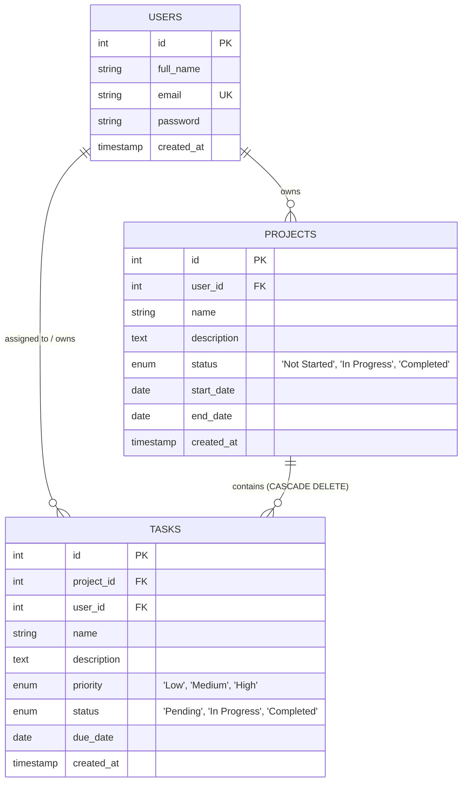

# Database Entity Relationship Diagram (ERD) & Schema Documentation

The **Project Management System** utilizes a normalized relational database design powered by MySQL.

---

## Entity Relationship Diagram (Mermaid)

---

## Detailed Table Schemas

### 1. `users` Table
Stores user credentials and profile details.
| Column | Type | Constraints | Description |
| :--- | :--- | :--- | :--- |
| `id` | `INT` | `AUTO_INCREMENT`, `PRIMARY KEY` | Unique User ID |
| `full_name` | `VARCHAR(100)` | `NOT NULL` | User's full name |
| `email` | `VARCHAR(150)` | `NOT NULL`, `UNIQUE` | Unique user email address |
| `password` | `VARCHAR(255)` | `NOT NULL` | bcrypt hashed password |
| `created_at` | `TIMESTAMP` | `DEFAULT CURRENT_TIMESTAMP` | Account creation timestamp |

### 2. `projects` Table
Stores user projects.
| Column | Type | Constraints | Description |
| :--- | :--- | :--- | :--- |
| `id` | `INT` | `AUTO_INCREMENT`, `PRIMARY KEY` | Project ID |
| `user_id` | `INT` | `FOREIGN KEY (users.id) ON DELETE CASCADE` | Owner User ID |
| `name` | `VARCHAR(150)` | `NOT NULL` | Project Title |
| `description` | `TEXT` | `NULLABLE` | Project Description |
| `status` | `ENUM` | `'Not Started'`, `'In Progress'`, `'Completed'` | Current status |
| `start_date` | `DATE` | `NULLABLE` | Scheduled start date |
| `end_date` | `DATE` | `NULLABLE` | Scheduled end / due date |
| `created_at` | `TIMESTAMP` | `DEFAULT CURRENT_TIMESTAMP` | Project creation timestamp |

### 3. `tasks` Table
Stores tasks linked to specific projects and users.
| Column | Type | Constraints | Description |
| :--- | :--- | :--- | :--- |
| `id` | `INT` | `AUTO_INCREMENT`, `PRIMARY KEY` | Task ID |
| `project_id` | `INT` | `FOREIGN KEY (projects.id) ON DELETE CASCADE` | Associated Project ID |
| `user_id` | `INT` | `FOREIGN KEY (users.id) ON DELETE CASCADE` | Owner User ID |
| `name` | `VARCHAR(150)` | `NOT NULL` | Task Title |
| `description` | `TEXT` | `NULLABLE` | Detailed task description |
| `priority` | `ENUM` | `'Low'`, `'Medium'`, `'High'` | Priority tier |
| `status` | `ENUM` | `'Pending'`, `'In Progress'`, `'Completed'` | Task execution state |
| `due_date` | `DATE` | `NULLABLE` | Target completion date |
| `created_at` | `TIMESTAMP` | `DEFAULT CURRENT_TIMESTAMP` | Task creation timestamp |

---

## Foreign Key Cascading Behavior
- When a user is deleted (`ON DELETE CASCADE`), all associated projects and tasks are automatically purged.
- When a project is deleted (`ON DELETE CASCADE`), all child tasks under that project are automatically deleted.
